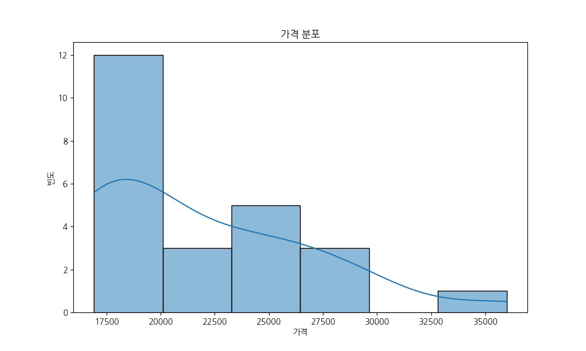
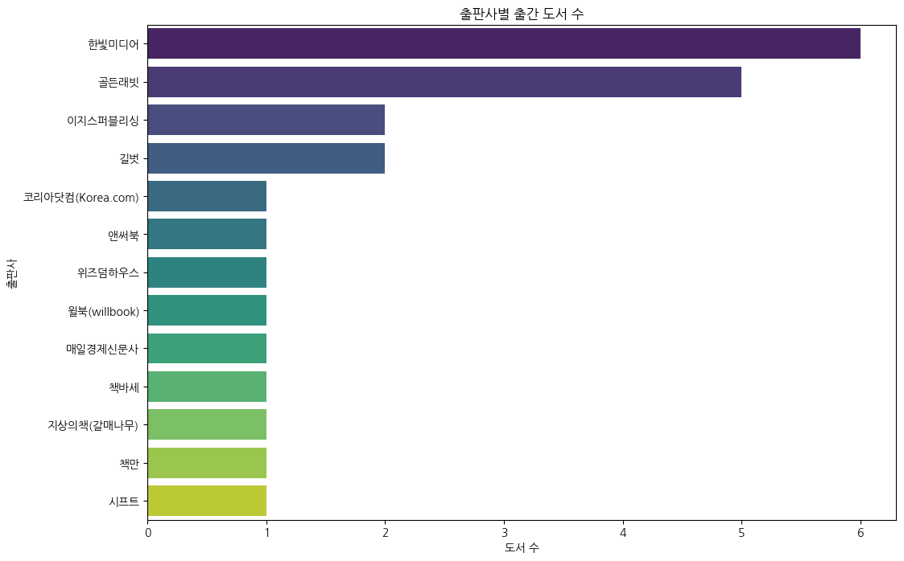
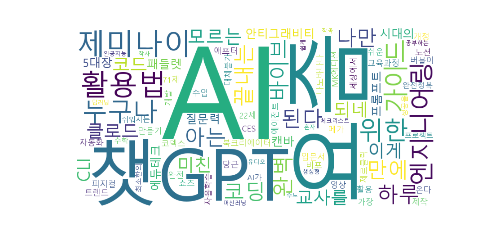

# YES24 AI 도서 데이터 분석

이 문서는 YES24에서 수집된 AI 관련 도서 데이터를 분석하고 시각화하는 과정을 담고 있습니다.

## 1. 라이브러리 및 데이터 불러오기

먼저 분석에 필요한 라이브러리를 불러오고, `yes24_ai.csv` 파일을 `pandas` DataFrame으로 읽어옵니다.

```python
import pandas as pd
import matplotlib.pyplot as plt
import seaborn as sns
from wordcloud import WordCloud
import koreanize_matplotlib
import re

# 데이터 불러오기
df = pd.read_csv("data/yes24_ai.csv")
```

## 2. 데이터 개요 확인

데이터의 기본적인 구조와 통계를 확인합니다.

### 데이터 샘플
```python
print(df.head().to_markdown(index=False))
```
| title | author | publisher | publication_date | price |
|:---|:---|:---|:---|:---|
| 된다! 하루 만에 끝내는 제미나이 활용법 | 권서림 저 | 이지스퍼블리싱 | 2025년 11월 | 18000 |
| 요즘 바이브 코딩 안티그래비티 완벽 가이드 | 최지호 저 | 골든래빗 | 2026년 02월 | 25200 |
| 누구나 아는 나만 모르는 제미나이 | 이성원 저 | 한빛미디어 | 2026년 01월 | 17100 |
| AI 시대의 질문력, 프롬프트 엔지니어링 | 류한석 저 | 코리아닷컴(Korea.com) | 2025년 08월 | 24300 |
| 요즘 교사를 위한 에듀테크 5대장 : 캔바, 패들렛, 북크리에이터, 노션, 챗GPT∙제미나이 | 안익재, 황의태 저 | 앤써북 | 2025년 12월 | 17820 |

### 데이터 정보
```python
df.info()
```
```
<class 'pandas.core.frame.DataFrame'>
RangeIndex: 25 entries, 0 to 24
Data columns (total 5 columns):
 #   Column            Non-Null Count  Dtype 
---  ------            --------------  ----- 
 0   title             25 non-null     object
 1   author            25 non-null     object
 2   publisher         25 non-null     object
 3   publication_date  25 non-null     object
 4   price             25 non-null     int64 
dtypes: int64(1), object(4)
memory usage: 1.1+ KB
```

### 기초 통계
```python
print(df.describe(include='all').to_markdown())
```
| | title | author | publisher | publication_date | price |
|:---|:---|:---|:---|:---|:---|
| count | 25 | 25 | 25 | 25 | 25 |
| unique | 25 | 20 | 16 | 11 | 18 |
| top | 된다! 하루 만에 끝내는 제미나이 활용법 | 최지호 저 | 한빛미디어 | 2026년 01월 | 18000 |
| freq | 1 | 2 | 6 | 7 | 4 |
| mean | NaN | NaN | NaN | NaN | 20956.8 |
| std | NaN | NaN | NaN | NaN | 5347.88 |
| min | NaN | NaN | NaN | NaN | 16920 |
| 25% | NaN | NaN | NaN | NaN | 17820 |
| 50% | NaN | NaN | NaN | NaN | 18000 |
| 75% | NaN | NaN | NaN | NaN | 25200 |
| max | NaN | NaN | NaN | NaN | 36000 |


## 3. 데이터 전처리

분석에 용이하도록 데이터를 가공합니다.

*   `price`를 숫자형으로 변환합니다.
*   `publication_date`에서 '년'과 '월'을 분리하여 새로운 컬럼을 만듭니다.
*   `author`에서 '저'와 같은 불필요한 단어를 제거하고 주 저자만 추출합니다.

```python
# 'price'를 숫자형으로 변환
df['price'] = pd.to_numeric(df['price'], errors='coerce')
df.dropna(subset=['price'], inplace=True)
df['price'] = df['price'].astype(int)

# 'publication_date'에서 '년'과 '월' 분리
df['year'] = df['publication_date'].apply(lambda x: int(re.search(r'(\d{4})년', str(x)).group(1)) if re.search(r'(\d{4})년', str(x)) else None)
df['month'] = df['publication_date'].apply(lambda x: int(re.search(r'(\d{1,2})월', str(x)).group(1)) if re.search(r'(\d{1,2})월', str(x)) else None)

# 'author'에서 '저' 제거 및 첫번째 저자만 선택
df['author_main'] = df['author'].apply(lambda x: str(x).split(',')[0].replace(' 저', '').strip())

print(df[['title', 'author_main', 'publisher', 'year', 'month', 'price']].head().to_markdown(index=False))
```
| title | author_main | publisher | year | month | price |
|:---|:---|:---|:---|:---|:---|
| 된다! 하루 만에 끝내는 제미나이 활용법 | 권서림 | 이지스퍼블리싱 | 2025 | 11 | 18000 |
| 요즘 바이브 코딩 안티그래비티 완벽 가이드 | 최지호 | 골든래빗 | 2026 | 2 | 25200 |
| 누구나 아는 나만 모르는 제미나이 | 이성원 | 한빛미디어 | 2026 | 1 | 17100 |
| AI 시대의 질문력, 프롬프트 엔지니어링 | 류한석 | 코리아닷컴(Korea.com) | 2025 | 8 | 24300 |
| 요즘 교사를 위한 에듀테크 5대장 : 캔바, 패들렛, 북크리에이터, 노션, 챗GPT∙제미나이 | "안익재, 황의태" | 앤써북 | 2025 | 12 | 17820 |


## 4. 데이터 시각화

### 가격 분포

도서 가격의 분포를 히스토그램으로 확인합니다.

```python
plt.figure(figsize=(10, 6))
sns.histplot(df['price'], kde=True)
plt.title('가격 분포')
plt.xlabel('가격')
plt.ylabel('빈도')
plt.savefig('data/price_distribution.png')
```


### 출판사별 출간 도서 수

어떤 출판사에서 AI 관련 도서를 많이 출간했는지 확인합니다.

```python
plt.figure(figsize=(12, 8))
publisher_counts = df['publisher'].value_counts().sort_values(ascending=False)
sns.barplot(x=publisher_counts.values, y=publisher_counts.index, palette='viridis')
plt.title('출판사별 출간 도서 수')
plt.xlabel('도서 수')
plt.ylabel('출판사')
plt.savefig('data/publisher_books.png')
```


### 도서 제목 워드클라우드

도서 제목에 자주 사용된 키워드를 워드클라우드로 시각화합니다.

```python
text = " ".join(title for title in df.title)
wordcloud = WordCloud(
    font_path='c:/Windows/Fonts/malgun.ttf',
    width=800,
    height=400,
    background_color='white'
).generate(text)

plt.figure(figsize=(15, 7))
plt.imshow(wordcloud, interpolation='bilinear')
plt.axis('off')
plt.savefig('data/title_wordcloud.png')
```


## 5. 결론

(분석 결과를 바탕으로 한 간단한 요약 및 인사이트를 작성합니다.)
*   AI 도서의 가격대는 주로 18,000원에서 25,000원 사이에 분포하고 있습니다.
*   '한빛미디어'와 '골든래빗'이 AI 관련 도서를 가장 많이 출간하는 출판사로 나타났습니다.
*   도서 제목에는 'AI', '제미나이', '활용법' 등의 키워드가 자주 등장하여, AI 기술의 실제 적용과 활용에 대한 독자들의 높은 관심을 엿볼 수 있습니다.
